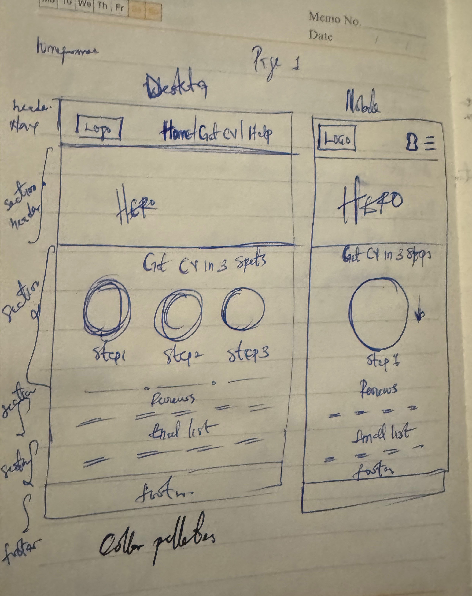
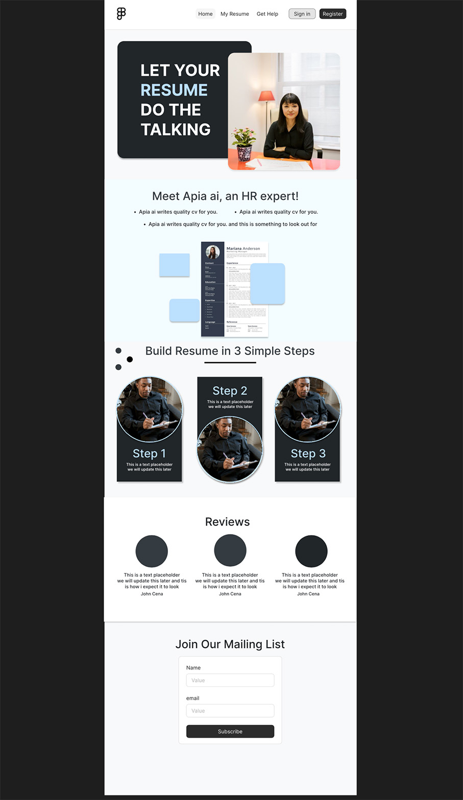
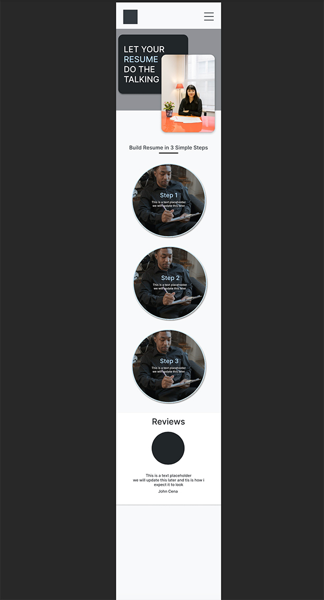

# Project Title: AI-Assisted Resume Builder

## Problem Statement

In today’s highly competitive job market, crafting a compelling and professional resume is crucial for job seekers. Many struggle to present their skills and experiences effectively, which can hinder their job search. Traditional resume building tools often provide limited assistance beyond basic templates, leaving users to manage the complex task of content creation and formatting on their own. Moreover, the integration of AI in resume building is still nascent, often lacking the capability to produce personalized and impactful content from sparse inputs like a LinkedIn profile.

## Proposed Solution

This project introduces an AI-assisted Resume Builder designed to simplify and enhance the resume creation process. The solution leverages AI to interpret and expand on LinkedIn profiles and user inputs, generating customized, high-quality CVs.

### Key features include:

**LinkedIn Integration:**
Users can input their LinkedIn profile link, from which the AI extracts key details to form a foundational resume.

**AI Rewriting Tools:**
AI algorithms rewrite user-provided content, ensuring the language is professional, impactful, and tailored to job descriptions.

**CV Upgrade:**
Users can upload existing CVs for AI-driven suggestions on improvements and enhancements.

**Template Variety:**
A wide range of templates allows users to choose designs that best fit their industry and personal style.

## Impact on Resume Writing

The AI-assisted Resume Builder streamlines the process of creating a resume by providing automated, intelligent tools that produce content not just formatted but optimized for the user’s career goals. It reduces the time and stress involved in resume creation and increases the chances of making a positive impression on potential employers.

## Competitor Analysis

Key competitors include traditional online CV builders like **Zety**, **LiveCareer**, and advanced platforms such as **Enhancv** that incorporate some AI elements. My solution sets itself apart by:

> - Providing deeper AI integration for content creation.
>   -Offering more personalized template selections.
>   -Enabling direct LinkedIn data import for ease of use.

## Prototype

The prototype developed provides a functional demonstration of the AI-assisted Resume Builder. It showcases the seamless flow from LinkedIn profile import to template selection and final CV generation. The prototype has been essential in validating the user interface and the underlying AI technology's effectiveness.

## UI/UX

he design focuses on simplicity and efficiency, ensuring that users can navigate the system intuitively. Key UI/UX highlights include:

> -Responsive Design: Ensures the builder is accessible on both desktop and mobile devices.
>
> - Minimalistic User Interface: Enhances focus and reduces user overwhelm.
>   -Interactive Elements: Guides users through the resume creation process with interactive tips and examples.

  
  

## Color Palette

The chosen color palette uses a blend of blues and grays, invoking professionalism and trust. Blue is often associated with reliability and calm, suitable for professional tools. The accents of vibrant colors in the buttons and links are designed to maintain user engagement and highlight interactive elements.
